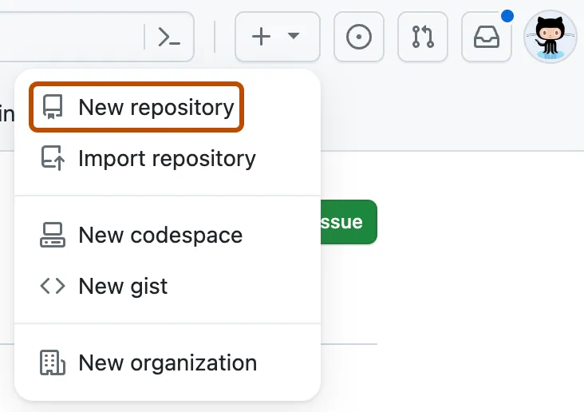
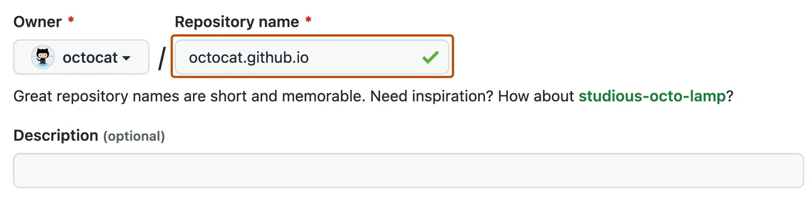
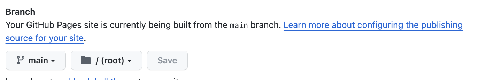

# Lab 1

## Creation of a Personal Page on GitHub Pages

In this evaluation, you will be asked to create a personal page on GitHub Pages. Follow the detailed instructions below to complete the task.

## Pre-Instructions

### Creating the Page on GitHub Pages

1. In the upper-right corner of any page, select , then click New repository (**crete a public repository**)
  
2. Enter username.github.io as the repository name. Replace username with your GitHub username. For example, if your username is octocat, the repository name should be octocat.github.io.
  

3. Under your repository name, click  Settings. If you cannot see the "Settings" tab, select the  dropdown menu, then click Settings.

4. In the "Code and automation" section of the sidebar, click  Pages.

5. Under "Build and deployment", under "Source", select Deploy from a branch, select main branch.

6. Under "Build and deployment", under "Branch", use the branch dropdown menu and select a publishing source, select root

> https://docs.github.com/en/pages/getting-started-with-github-pages/creating-a-github-pages-site

### Clone Repository

First, clone the repository to your computer and create a blank index.html file to start the laboratory.

## Instructions

### Creation of a Personal Page

Design a personal page that contains relevant information about you:

- Name
- Major
- Year of University Enrollment
- Link to your Github
- Personal summary
- A table showing the skills you possess and your level of expertise, for example:

| Skill          | Level  |
|--------------------|--------|
| Python             | Expert |
| JavaScript         | Basic |
| HTML/CSS           | Basic |
| Git                | Basic |
| Excel              | Advance |
| SQL                | Expert |
| Ruby               | Basic |
| English            | Advance |
| Spanish            | Native |

## Requirements

- Ensure all required information is included as per the instructions.
- Use HTML tags to properly structure your page.
- Change the font type throughout the page.
- Use classes to apply styles to your page.
  - At a minimum, changes in color, background, and styles in the table are expected.
- Create a button and a text input field where, upon pressing the button, a section of the page (other than the one requested in the instructions) changes with the value entered in the text field.
- The tag for a button is `<button>`
- The tag for a text input field is `<input type="text">`
  - For more information on how the input works, refer to [link](https://www.w3schools.com/tags/tag_input.asp)

### Submission

Upload the repository link with the webpage link to Canvas.